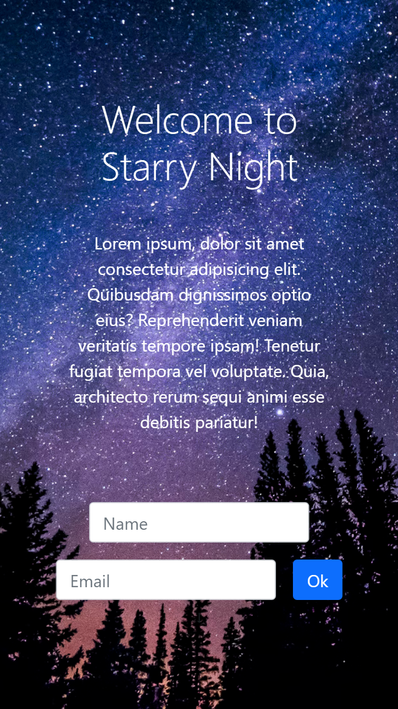

Space Observatory Website Project
This project is inspired by the Udemy course: https://www.udemy.com/share/101v0q3@YMrao6ucZyhesZHKMA82n7GMjK5CdO1VrP_-Wuf0L4O0pFo56bqEA9Rm9DUWVgGfkQ==/

# Screenshot

# Links

- Solution URL: https://github.com/denisazaharia98/Bootstrap-5-Projects/tree/main/Space%20Observatory%20Webpage%20Project
- Live Site URL: https://denisazaharia98.github.io/Bootstrap-5-Projects/Space%20Observatory%20Webpage%20Project/

# Built with

- Semantic HTML5 markup
- CSS custom properties
- Flexbox
- Bootstrap 5

#Useful resources

-https://getbootstrap.com/
